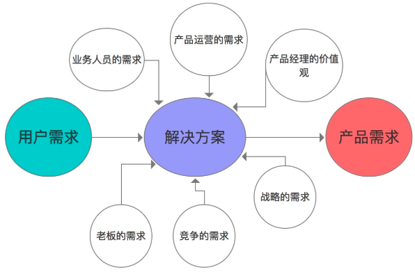

需求分析
=================

   * [如何判断用户需求](#如何判断用户需求)
      * [什么是需求](#什么是需求)
      * [需求从那里来](#需求从那里来)
      * [痛点和需求的关系](#痛点和需求的关系)
      * [怎么发现痛点](#怎么发现痛点)
   * [如何判断用户需求](#如何判断用户需求-1)
      * [判断维度](#判断维度)
         * [痛点的价值有多大](#痛点的价值有多大)
         * [判断痛点能否被解决](#判断痛点能否被解决)
         * [目标用户群体有多大](#目标用户群体有多大)
         * [人群的商业价值有多大](#人群的商业价值有多大)
   * [如何定义用户需求](#如何定义用户需求)
      * [Why?](#why)
      * [How?](#how)
         * [构建用户角色](#构建用户角色)
            * [确定目标人群](#确定目标人群)
            * [用户角色划分](#用户角色划分)
            * [定义用户问题](#定义用户问题)
      * [怎么管理用户需求](#怎么管理用户需求)
         * [user story](#user-story)
   * [如何定义产品需求](#如何定义产品需求)
      * [全面采集需求](#全面采集需求)
      * [构建产品方案](#构建产品方案)
         * [业务模式构建](#业务模式构建)
         * [盈利模式构建](#盈利模式构建)
         * [产品形态构建](#产品形态构建)
         * [运营模式构建](#运营模式构建)
         * [产品创新](#产品创新)
      * [确定产品功能](#确定产品功能)
         * [步骤](#步骤)
            * [明确用户角色](#明确用户角色)
            * [设置角色任务](#设置角色任务)
            * [梳理任务关键节点](#梳理任务关键节点)
            * [设计产品功能](#设计产品功能)
         * [总结](#总结)
   * [怎么评估产品需求](#怎么评估产品需求)
      * [产品需求分类](#产品需求分类)
         * [KANO 模型](#kano-模型)
            * [基础型需求功能](#基础型需求功能)
            * [期望型需求功能](#期望型需求功能)
            * [兴奋型需求功能](#兴奋型需求功能)
            * [无差异型需求功能](#无差异型需求功能)
            * [反向需求功能](#反向需求功能)
            * [一般使用问卷调查](#一般使用问卷调查)
         * [在分类后](#在分类后)
      * [产品版本规划](#产品版本规划)
         * [分解产品目标](#分解产品目标)
         * [确定版本的功能](#确定版本的功能)
         * [需求评审确定可行性](#需求评审确定可行性)
      * [功能优先级排序](#功能优先级排序)
   * [怎么管理产品需求](#怎么管理产品需求)
      * [交付需求](#交付需求)
         * [步骤 - 提交需求](#步骤---提交需求)
            * [产品流程图](#产品流程图)
            * [产品原型](#产品原型)
            * [评审需求](#评审需求)
      * [制定需求实施计划](#制定需求实施计划)
         * [和研发确定开发计划](#和研发确定开发计划)
         * [和设计人员确定UI设计计划](#和设计人员确定ui设计计划)
         * [和运营人员确定运营计划](#和运营人员确定运营计划)
      * [控制需求变更](#控制需求变更)
         * [分析需求](#分析需求)
         * [分析变更的可行性](#分析变更的可行性)
         * [变更需求](#变更需求)

[【参考 - 需求分析】](http://www.woshipm.com/pmd/587068.html)

# 如何判断用户需求
## 什么是需求
```md
特定的人在特定的情况下产生了特定的问题，并且这种问题是可以被解决的
关键字 特定的人，特定的情况下，特定的问题，可以被解决
```
## 需求从那里来
```md
一个是来自用户的痛点，由痛点产生的需求，大多数会成为刚性需求
一个是来自用户的兴奋点，由兴奋点产生的需求往往是非刚性需求，它的需求同样可以很旺盛，但是在优先级排序上，往往靠后
```
## 痛点和需求的关系
```md
痛点是发现需求的第一步，但是痛点不等于需求，痛点约等于需求或者痛点大于需求。

举个极端的例子
	很多人都希望能长生不老，生命太过短暂就成了人的痛点
	但是这个痛点我们至今没法解决，这个痛点就是一个待解决的命题，而不是一个需求。
	如果我们的目标是让人的寿命更长，这个痛点就变成了一个需求

痛点能否变成需求，取决于我们是否有能力来解决这个痛点
```
## 怎么发现痛点
```md
“体验” 痛点是一种由体验得出来的结果，也唯有靠体验才能发现痛点。
```
```md
直接的体验 自己的体验，自己去现身说法，在体验的过程中发现痛点
间接的体验
	通过别人的体验结果来挖掘痛点
	形式多样
		周围人的吐槽
		网上的体验报告
		App Store的评价
		用户的留言
		异常的数据等
	尤其关注体验结果中哪些负面的反馈
		因为按照一般人的心理，得到好处不吱声，痛了肯定要找地方说出来。
```
# 如何判断用户需求
```md
需要判断的是痛点是否为可转化为用户需求
```
## 判断维度
### 痛点的价值有多大
```md
四个标准
	是否是迫切的
	是否必须解决
	出现频率是否高
	持续时间是否长
```
```md
大多数痛点处于高价值和低价值之间，需要综合后面其它的内容判断
```
### 判断痛点能否被解决
```md
一般通过一个简单的小调查就可以
	调查是否有人解决了这个痛点
	如果发现有人已经解决了这个痛点 可以接着往下看，看看是怎么解决的，解决的效果怎么样
	如果没有解决 要看看为什么没有解决，关键问题在什么地方，这个关键问题自己能不能解决
```
### 目标用户群体有多大
```md
当一个痛点被发现以后
	很多人会理所当然的把这个痛点想象成所有人都有这个痛点
	这种将个人的想法和观点强加给别人的情况在日常的工作中非常常见
```
```md
正确的做法是 想办法弄清楚有这个痛点的用户边界和数量
```
```md
初步收集用户特征
	痛点在初期一般来源于某个具体的人 首先找到这个人，将其特征标签化
	一般包括个人属性、社会属性、消费行为、目标、行为、使用场景、遇到的问题等
	这个可简单、可复杂，根据产品的大小和团队规模来决定
假设问题
	一般在产品初期，目标用户不明确 可以多做些假设，然后去研究，去拓展目标群体的边界
	在目标用户确定了以后，在产品中后期，可以基于具体的问题去假设分析
用户访谈
统计分析
输出画像，明确用户是谁
调查用户群体数量
```
### 人群的商业价值有多大
```md
两个指标 一个是收入 一个是可支配的消费
```
```md
如果一个痛点的用户群体很大，但是没有什么消费能力，这个痛点解决起来可能有问题
更适合去做公益的产品，而不是做商业的产品
```
# 如何定义用户需求
## Why?
```md
没有一个人站在用户角度说话
	很多人会容易忽略这一部分 直接把痛点，想法等因素和需求画等号，但想法随时会变，痛点也会被越来越多的发现
		如果按照想法和意见来展开工作，很容易导致后面的工作失焦
	需求讨论会常常变成失控的，无效的会议

对需求没有进行一个很好的定义
	就没有一个讨论的基础 有共同认知的前提下，每个人都在表达自己的想法就不奇怪
```
```md
是人为的把问题进行一个约束
	把问题限定在一定的范围内进行讨论和解决 目的是为了清晰目标，建立共识，减少分歧
定义用户需求是后续工作开展的基础
	一切工作围绕定义的这个用户需求展开，而不是围绕某个人的想法和意见展开
```
## How?
### 构建用户角色
#### 确定目标人群
```md
选择最符合公司利益的一部分人作为目标人群
比如你做一个考研的产品
	理论上考研的学生都有可能需要 但是你的老师只有四五个，只能搞定北京的市场
	那么你的目标用户是北京高校的大学生 而不是全国所有高校的大学生
```
#### 用户角色划分
```md
目标人群在整体上方向是一致的 个体的差异会非常大

理论上用户角色粒度划分的越细 需求定义的也会越准确
但是实际情况往往是不允许的 除非做个性化定制产品，否则我们也没有必要做到太细
```
#### 定义用户问题
```md
角色和场景都是前提 
用户的问题才是这里想要表达的最终意思，后期产品设计也是基于用户问题来设计方案，进而解决问题
```
```md
定义问题
就是透过用户的反馈，找到问题的本质 多问为什么？搞清楚用户真正需要的是什么？
```
```md
比如
	我们经常在工作中遇到用户反馈产品烂，产品难用
		有可能不是真的产品有多烂，而是因为网速不好
		这时候问题的解决方案是引导用户解决网速问题就可以了
			有可能一句文案就解决了，而不是根据用户意见改进产品
```
## 怎么管理用户需求
### user story
```md
推荐使用描述用户故事（user story)的方式来记录
一般的描述格式
	作为一个<用户角色>, 我想要<xxx>, 以便于<商业价值>
	比如 作为一名老师，我想要查看报名的学生人数，以便于更好的安排课程计划
```
# 如何定义产品需求
```md
面对同样的用户需求 不同的人，会提供不同的解决方案
从用户需求到提供产品方案的过程 我们把它称为定义产品需求的过程
很多人容易忽略这个过程，直接把用户的需求当成产品的需求做出来 用户需求并不等于产品需求
```
## 全面采集需求
```md
公司战略层面的需求
	是产品设计的指向标
		一般是公司高层来决定的，作为产品经理必须了解公司的战略意图
	比如说公司要求产品在上线后就开始创造收入
		那么我们在设计产品的时候，就得考虑盈利模式，进行变现功能的设计
	比如公司对产品的定位是在市场上进行卡位
		那么我们在设计产品的时候，就需要更多的考虑竞争对手的产品
```
```md
用户层面的需求
	指的是目标用户 要收集他们的显性需求 比如他们想要一匹更快的马
	还要收集他们的隐性需求 实际上是为了更方便，快捷，高效的出行
```
```md
业务人员的需求
	业务人员包括与产品接触的内部及外部的人
		比如公司的运营，市场，销售，BD, 公司的外部合作伙伴等
	比如
		运营人员想更方便的管理注册用户
		销售想更多的添加广告位
	总之只要与业务有关的人的意见 尽可能的在产品设计前多收集，即使做不了，也告诉他们原因
```
```md
领导/老板的需求
	在任何一个公司，小公司的老板和大公司的领导 都是很特殊的存在 大多没有做皇帝的命却有做皇帝的心
	当然这里不是鼓励拍老板马屁，而是要收集老板的需求意见。
```
```md
产品运营的需求
	为了产品更好的运转而产生的需求
	比如产品上线后
		就产生了需要用户持续的活跃，利用用户传播的需求 基于这些需求，在产品设计的时候
			就需要考虑设计相应的激励产品，用户激励体系，用户等级，用户邀请用户等功能
		这部分需求非常重要
			如果说用户的需求是血和肉，那么这部分需求就是把血和肉连接起来的骨架
```
```md
来自竞争的需求
	这部分需求有可能是用户需要的，有可能是用户不需要的 总之是因为竞争而产生的需求
	比如摩拜单车和ofo开始补贴大战了 在产品设计的时候就需要考虑怎么去实现补贴功能，是设计成充值返现，优惠券还是发红包。
	这部分需求是产品进步的最大动力 想想一个没有竞争对手的产品，也就没有什么优化和改进的必要了。
```
```md
来自产品经理本人喜好的需求
	包括一个人的价值观，审美，情怀等需求
	这些需求虽然不是用户直接需要的
		但能让产品独具一格，也是产品打动用户最重要的部分
	比如Google的产品理念是不作恶，苹果的产品在设计方面都非常简洁，非常超前
		张小龙对微信在盈利方面的克制，锤子手机的情怀等
```
## 构建产品方案
### 业务模式构建
```md
业务模式就是这个业务怎么运转起来
跑黑车是一种模式，出租车公司买车，招司机，拿拍照也是一种模式
	租车公司买车然后出租也是一种模式，滴滴打车利用软件来连接客户和司机，也是一种模式
业务一般在大的方向上，包含两个方向
	一个是to b的，面对企业的模式
	一个是to c的
		面向个人的模式
	包括B2B，B2C，C2C 甚至B2B2C等多重模式
```
### 盈利模式构建
```md
盈利模式简单点来说，就是这个产品怎么赚钱

广告模式
增值服务模式
	比如qq的会员服务，视频网站的会员服务，游戏里面卖道具等
电子商务模式
	比如京东向用户买东西赚差价，支付宝赚交易的佣金，滴滴打车抽提成等都属于电子商务模式的范畴
联合运营模式
	这种模式在游戏行业用的比较多 一方有流量，一方有好的产品，两者合作来赚钱然后分成
服务费模式
	这种盈利模式面向企业服务使用的比较多
	尤其是近两年，企业服务比较火，很多做saas服务的都是这种模式 每年交一定的费用，享受一年的产品服务
```
### 产品形态构建
```md
构建产品形态就是让这个产品长什么样子
主流的产品形态有
	bbs，新闻资讯，搜索引擎，SNS，O2O，IM,  LBS, 团购，直播，众筹等多种形态
```
```md
使用现有的产品形态
```
```md
微创新方式
杂交法
	把现有成熟的产品形态相互杂交形成新的产品形态
	比如sns+电商就成了蘑菇街，美丽说等网站 IM+电商成了微店，有赞商城等 IM+手机＋地理位置成了陌陌
	手机＋自行车成了ofo和摩拜单车

改造法
	对现有的产品形态进行改造
	比如新浪微博的灵感来源是美国的twitter
		但是新浪微博对twitter模式进行了改造，例如评论功能
			新浪微博的评论是类似bbs的盖楼模式，而twitter的评论和转发是一起的
		新浪微博通过对twitter的改造形成了国内独有的社交＋媒体的产品形态
```
```md
原创的方式
	国内比较少 一个是阿里巴巴的b2b网站，一个是大众点评，还有一个是豆瓣
	以原创的方式构建产品形态 对团队能力和成本要求都比较高
	    如果构建的好，有可能会被很多人抄袭
        如果构建的不好，会让公司担负比较大的试错成本
```
### 运营模式构建
```md
运营模式就是通过人为的手段让产品运转起来
根据不同的产品形态，可以设置不同的模式
```
```md
ugc 调动用户为网站生产内容
pgc 通过聘请专业的人士对网站产生内容
众包 通过利用闲散的人力资源来达到运营目的
众筹 通过收集小额闲散的资金来获得一大笔资金来做一件事情
p2p 通过用户和用户之间的交易和交流满足彼此需求 一般可以从用户和内容两方面来构建
```
### 产品创新
```md
很多人以为创新就是做完全不一样的产品
	一个产品方案包含四部分内容，创新也可以从这四个方面去创新
```
## 确定产品功能
```md
在构建了产品方案，就要进行具体的功能设计了，怎么设计产品的功能呢
```
### 步骤
#### 明确用户角色
```md
比如一个类似微信的产品用户角色可以分成普通用户，公众号运营者，开发者等
	在普通用户中按照用户的使用熟练程度又可以分成新手用户，中级用户，高级用户
	根据用户关系可以分成群主，好友，非好友，黑名单用户等
总之需要明确这个产品涉及到的所有角色
```
#### 设置角色任务
```md
基于上面明确的每个用户角色，为每个用户设置产品任务
比如对公众号运营者，我们可以设置发布文章的任务 这个任务的设置一般是与用户的需求有一定的对应的关系的。
```
#### 梳理任务关键节点
```md
基于上面设计出的关键节点
	在每一个关键节点基于实际需求进行发散，最后串联起来形成了产品的功能
```
#### 设计产品功能

### 总结
```md
不断的重复上面四个步骤，我们就可以不断的丰富产品的功能
```

# 怎么评估产品需求
```md
需要产品人员对产品需求进行评估，找到在当前阶段最重要的功能进行开发
```
## 产品需求分类
### KANO 模型
```md
是东京理工大学教授狩野纪昭发明的
是以分析用户需求对用户满意的影响为基础 对用户需求进行分类和优先排序的方法 将影响用户对产品满意度的需求分为5类
```
#### 基础型需求功能
```md
是指有了这个功能，用户并不会对这个产品产生多少好感 但是没有这个功能，用户的满意度会直线下降的功能
通常都是产品中的基础功能 比如一个社交产品中的加好友功能，留言，分享等功能，这些都是用户社交互动中一些标配。
```
#### 期望型需求功能
```md
是指有了这个功能，用户的好感会明显增加 没有这个功能，用户的不满也会增加
这类功能往往对应的都是用户的核心需求
```
#### 兴奋型需求功能
```md
是指有了这个功能，用户的好感会明显增加 没有这个功能，用户也不会觉得怎么样
往往是一些很酷炫，很花哨，但是实际上用处不大的功能 很多社交软件都有换背景，个性化装扮这类功能
兴奋型需求往往是在功能刚推出的时候用户觉得有新鲜感 但随着使用时间的变长，兴奋度会慢慢降低，功能慢慢就会被用户放弃。
```
#### 无差异型需求功能
```md
是指有了这个功能，用户可能会使用
	但不会表现出满意的想法，没有这个功能，用户也不会不满意
总之这个功能有没有，对用户的使用这个产品影响不大
像很多产品中都有企业的自我介绍，产品版本信息介绍，引导用户去appstore点评等就属于这类功能。
```
#### 反向需求功能
```md
是指没有这个功能，用户不会不满意的
	但是有了这个功能，用户满意度反而会直线的下降的功能
反人性的需求都可能出现这种情况
	比如在社交网站中，注册的时候收集过多的用户资料数据，导致注册流程太长
大多数是没必要做的，并不是绝对反向的，也不是不可以做的
	比如原来免费的产品，增加了收费功能必然面临免费使用人群满意度的下降
```
#### 一般使用问卷调查
```md
数据分析等方法来对需求进行分类
	但kano模型分析法是针对消费品的，比如洗发水，洗衣粉等
对于互联网产品来说
	用户在没有看到一个App长成什么样的之前，根本没法表达意见
	所以在分类的时候，不建议再使用用户研究的方法
		可根据自己的直觉，经验，还有内部讨论的方式进行分类
```
### 在分类后
```md
一般是在兴奋型需求，无差异型需求和反向型需求中删减
剩下的这些功能需求会呈现一个金字塔的形状
```


## 产品版本规划
```md
将产品划分成不同的版本，按照版本进行开发
```
### 分解产品目标
```md
就是把大的方案，分解成一个个小方案，先实现一个一个小目标
	小目标都实现了，最后大目标就实现了
一般结合产品的生命周期来设置产品目标
	种子期 验证用户反馈
	成长期 完善产品功能
	成熟期 实现商业变现
	衰退期 寻找新的增长点
```
### 确定版本的功能
```md
可以根据目标对产品需求再进行分类，确定实现每个目标需要的功能
分类考虑因素
	在种子期
		一般采取mvp的模式 用尽可能少的功能实现用户需求，一般优先实现期望型需求和部分基础型需求功能
	在成长期
		需要产品不仅能运行起来，还需要吸引更多用户使用，要稳定，安全的运行
		这时候需要做大量基础型功能和期望型需求，以及部分兴奋型需求功能
	在成熟期
		需要变现，这时候可以考虑做广告，支付等反向型需求功能
	在衰退期
		用户增长放缓，可以做一些兴奋型需求功能来刺激用户
		也可以找新的期望型需求，满足用户没有被满足的需求
```
### 需求评审确定可行性
```md
需要组织研发，社交，运营等小伙伴一起对划分的版本和功能可行性进行评估
```
## 功能优先级排序
```md
在完成了产品规划，我们就要进入产品实施阶段 这时候就需要把所有的功能的优先级级都明确下来
优先开发的版本所包含的产品需求优先级是最高的 到了这里，我们终于弄明白了，该优先实现那些功能
```
# 怎么管理产品需求


## 交付需求
```md
产品经理本身不能对产品方案进行实施 需要将自己梳理的产品需求，传达给负责实施的人 这个过程就是交付需求的过程
```
### 步骤 - 提交需求
#### 产品流程图
```md
产品流程图是说明产品操作和相应过程的文档
    一类是业务流程图 基于业务逻辑来设计，一般包含主要流程和功能模块，用来说明产品的架构
	一类是功能流程图 一般基于用户任务来设计 包含人物角色，操作过程的关键节点，状态，判断，结果等
```
#### 产品原型
```md
流程图主要偏重于对产品后端和逻辑的描述
	而产品原型的作用正好与流程图互补，偏重于对产品界面信息架构
		跳转逻辑和交互功能的展示说明
通过产品原型
	可以将抽象的产品具体化，让产品更容易被理解，产品原型一般由线框图构成
	在业界大部分人使用axure来制作，有的公司有交互设计师，原型制作工作由交互设计师来承担
```
#### 评审需求
```md
组织研、运营、设计、测试等人员对产品需求评审
	在评审过程中，对产品的目标、背景、问题、思路、解决方案等进行介绍
```
```md
目的
	为了让产品更完善，更具有可行性
	让所有参与实施的人员对产品需求认可，目标达成一致
```
## 制定需求实施计划
```md
实施前需要和具体的执行人一起来确定执行计划
```
### 和研发确定开发计划
```md
谁来做？
什么时候开始做？
什么时候完成？
什么时候测试？
什么时候测试版上线？
什么时候正式版上线？
```
### 和设计人员确定UI设计计划
```md
谁来设计？
什么时候开始设计？
什么时候出主风格？
什么时候完成设计？
```
### 和运营人员确定运营计划
```md
谁来运营？
什么时候开始试运营？
运营计划和资源准备？
```
***注意点***
```md
明确干系人
明确工作中的关键时间节点
在计划中要考虑风险因素，和执行成员事先商量好规避的办法
```
## 控制需求变更
```md
在需求评审完成后，产品会进行封版，需求池也会冻结
	但是有时候因为一些客观因素，需求变更又是不可避免的
```
### 分析需求
```md
新需求需要走相同的需求分析流程
```
### 分析变更的可行性
```md
考虑变更需求对用户使用的影响
考虑需求变更带来的成本因素
考虑市场的机会成本
```
### 变更需求
```md
需要进行需求变更后的产品流程，功能，原型，文档制作和变更工作。
协调其它参与人，及时把需求变动告知相关人员，让其对工作做出对应的调整
```